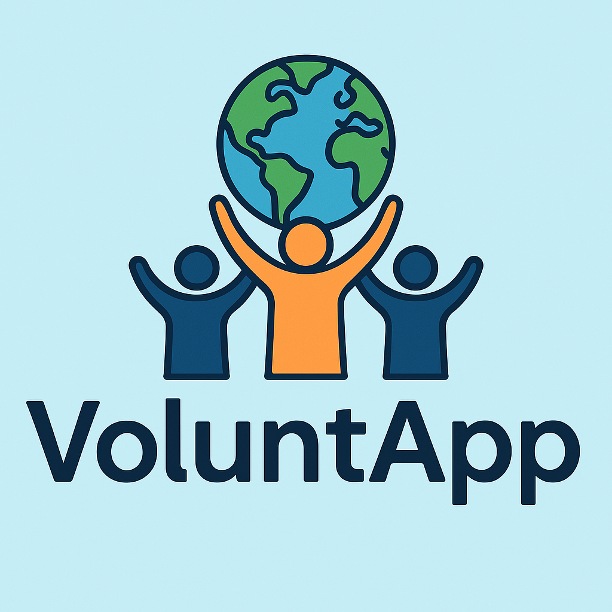

# VoluntApp - Plataforma de Voluntariado Social 🌍

<div align="center">
  
</div>

¡Bienvenido/a a **VoluntApp**! Este proyecto es un **prototipo educativo** que integra varias tecnologías para demostrar cómo crear una aplicación web (y base para móvil) que conecte a personas con actividades de voluntariado y responsabilidad social.

## 👥 Integrantes del Proyecto

| Usuario GitHub | Cargo en la App       | Responsabilidad Principal         |
|----------------|------------------------|-----------------------------------|
| [marichu-k](https://github.com/marichu-k) | Desarrolladora Principal | Lógica de negocio y seguridad     |
| [JoseUFV22](https://github.com/JoseUFV22) | Backend Developer                  | Pruebas, gestion de datos y API          |
| [Hugo_Guarido](https://github.com/hguarido55) | Diseñador BD         | Interfaz y gestión de la Base de Datos |
| [IgnacioPDA](https://github.com/IgnacioPDA) | Frontend Developer       | Gestión de interfaz            |
| [vittopa](https://github.com/vittopa)     | Backend Developer                  | Pruebas, gestion de datos y API |


## ✨ Características Principales

- **Registro e Inicio de Sesión** (Flask-Login y WTForms)  
  - Soporta distintos roles: voluntario, organización y administrador.
- **Mapa Interactivo** (Folium)  
  - Centrado en Madrid, con marcadores de organizaciones reales (Banco de Alimentos, Cruz Roja).
- **Gestión de Actividades**  
  - Crear y listar oportunidades de voluntariado.  
  - Inscribirse y registrar la participación.
- **Registro de Horas**  
  - Cada usuario voluntario va sumando sus horas.
- **Reportes en PDF** (ReportLab)  
  - Permite exportar fácilmente el listado de actividades y horas.

## ⚙️ Tecnologías y Librerías

- **Python** (3.x)
- **Flask** (microframework web)
- **Flask-Login** (gestión de sesiones de usuario)
- **Flask-WTF** y **WTForms** (creación y validación de formularios)
- **SQLite** (base de datos local)
- **Folium** (integración de mapas interactivos)
- **ReportLab** (generación de reportes en PDF)
- **Werkzeug Security** (hashing de contraseñas)

## 🏗️ Estructura del Código

En un solo archivo `VoluntApp.py` para fines didácticos:
1. **Modelos** (User, Organizacion, Actividad) con SQLAlchemy.
2. **Formularios WTForms** (RegisterForm, LoginForm, ActividadForm).
3. **Rutas** de Flask para registro, login, mapa, actividades, PDF, etc.
4. **Plantillas incrustadas** mediante `render_template_string` (idealmente se usarían archivos HTML en `/templates`).
5. **Inicialización** de la base de datos y creación de usuarios y organizaciones de ejemplo.

## 🚀 Ejecución

1. **Instalar dependencias**:
   ```bash
   pip install flask flask_sqlalchemy flask_login flask_wtf wtforms folium reportlab
   ```
2. **Iniciar la aplicación**:
   ```bash
   python VoluntApp.py
   ```
